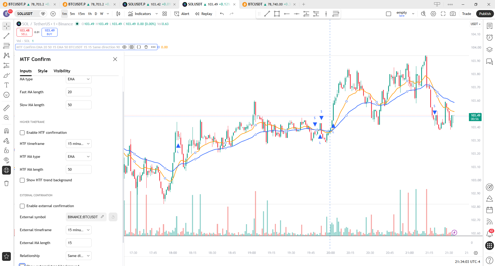
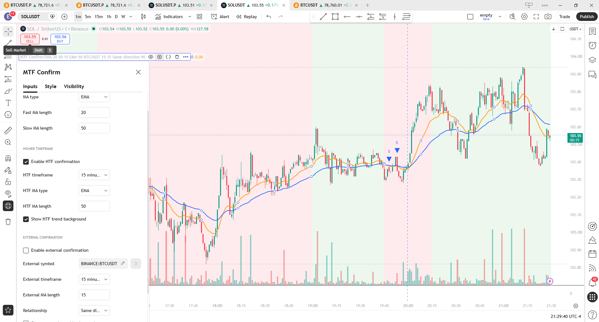
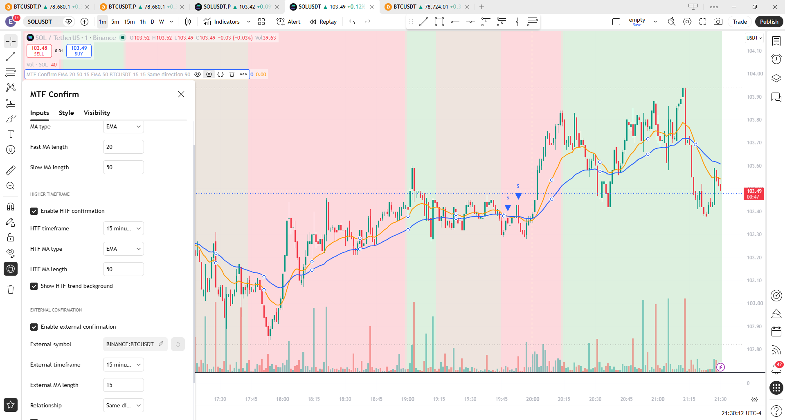
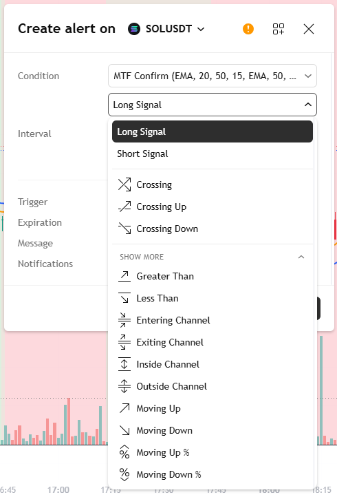

# MTF Confirmation Indicator

A TradingView Pine Script v6 indicator that turns a simple moving-average crossover into a configurable confirmation framework using higher-timeframe trend, optional external-symbol confirmation, closed-bar signal logic, validation, and TradingView alerts.

## What it does

The indicator starts with a configurable fast/slow moving-average crossover on the chart timeframe, then lets you filter those signals using:

- Higher-timeframe trend confirmation
- Optional external-symbol confirmation
- Same-direction or inverse external relationships
- Confirmed chart-bar signal timing
- TradingView alert conditions

This makes it useful as a reusable framework for turning discretionary confirmation rules into deterministic Pine Script logic.

## Features

- Pine Script v6
- Configurable EMA/SMA base signal
- Fast/slow moving-average crossover logic
- Closed-bar long and short signals
- Higher-timeframe confirmation
- Confirmed HTF values using the previous completed HTF bar
- Optional HTF trend background for visual verification
- Optional external-symbol confirmation
- Confirmed external values when the selected external timeframe is higher than the chart timeframe
- Same-direction or inverse-direction external confirmation
- Optional external trend background for historical verification
- Shared bullish/bearish background colors and transparency controls
- HTF filter automatically disables when the selected HTF is equal to or lower than the chart timeframe
- Clear chart warning for invalid HTF selection
- Dedicated Long Signal and Short Signal TradingView alert conditions
- Clean grouped inputs

## Timeframe behavior

### Higher-timeframe confirmation

The HTF module uses the previous completed higher-timeframe bar so historical and realtime behavior remain consistent.

If the selected HTF is equal to or lower than the chart timeframe, the HTF filter is disabled automatically and the indicator shows a warning on the chart.

### External confirmation

External confirmation is intended for the chart timeframe or a higher timeframe.

When the selected external timeframe is higher than the chart timeframe, the indicator uses confirmed external data from the previous completed external bar.

Lower external timeframes are not part of the v1 support contract.

## Validation

The current version has been manually verified in TradingView for:

- Base crossover signals with both confirmation modules disabled
- HTF filtering enabled independently
- External-symbol filtering enabled independently
- HTF and external filtering enabled together
- Invalid HTF selection with automatic filter disable and warning
- Historical stability after chart reload
- External higher-timeframe confirmation on a 1m chart with 5m external data
- Long Signal and Short Signal availability in the TradingView alert dialog

## Screenshots

### Base signal mode

Base EMA crossover signals with both confirmation filters disabled.

### Higher-timeframe confirmation

15-minute higher-timeframe trend confirmation filtering signals on a 1-minute chart.

### HTF + external-symbol confirmation

Combined higher-timeframe and BTCUSDT external-symbol confirmation with historical trend visualization.

### TradingView alerts

Dedicated Long Signal and Short Signal conditions available directly in TradingView alerts.

## Source

Main Pine Script source:

`src/mtf_confirmation_indicator.pine`
